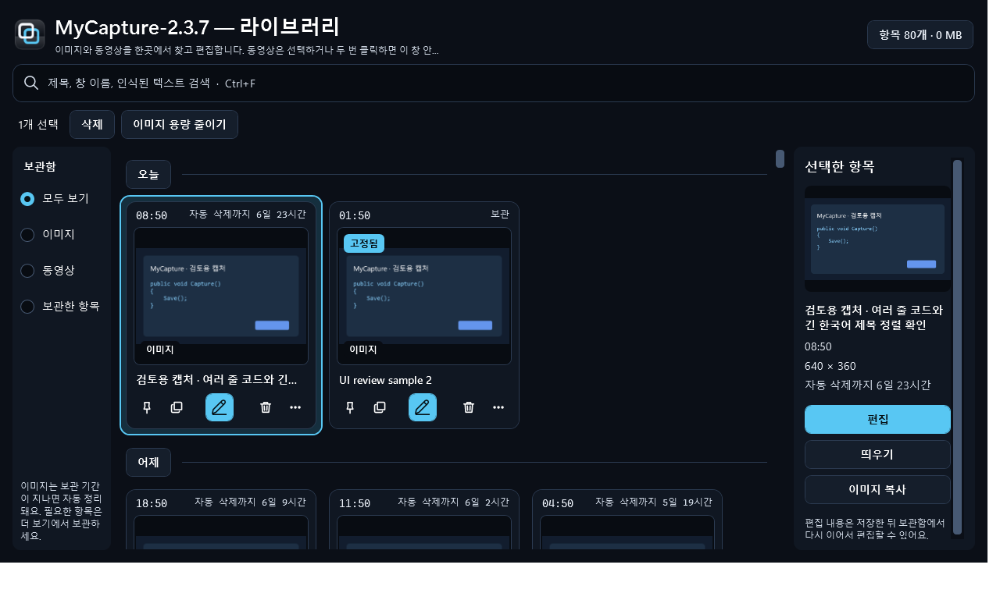
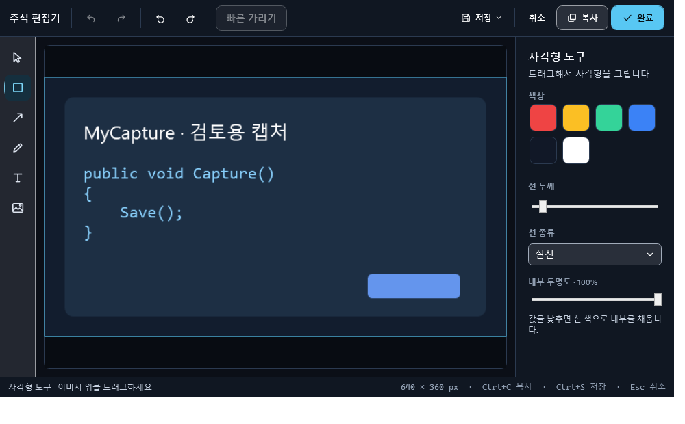
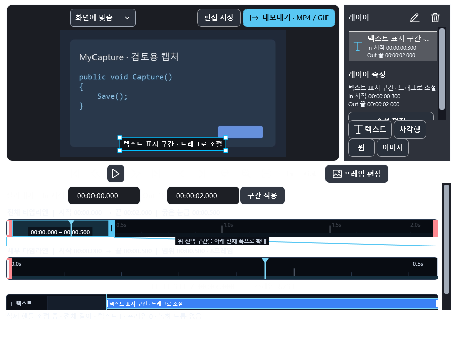
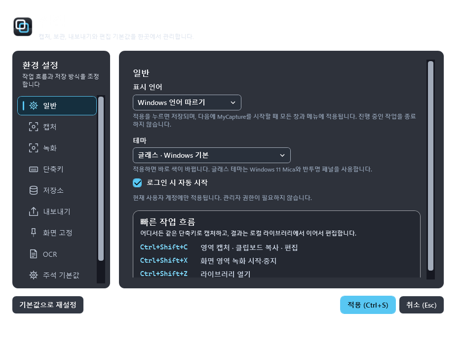

# 사용법 가이드

MyCapture의 핵심 흐름을 스크린샷과 함께 정리했습니다. 모든 이미지는 MyCapture의 UX 자가 검사(`--selftest-ux-review`)가 실제 창을 렌더링해 만든 것입니다.

## 1. 라이브러리 — 캡처와 영상을 한곳에서

라이브러리(`Ctrl+Shift+Z`)는 이미지와 MP4를 함께 보여주고, 날짜별로 묶어 줍니다. 왼쪽 필터(모두 보기 / 이미지 / 동영상 / 보관한 항목)로 좁히고, 타일을 클릭하면 오른쪽 상세 패널에서 시간·크기·보관 기한과 편집·재생·복사 동작을 쓸 수 있습니다.

- 검색창(`Ctrl+F`)은 제목, 창 이름, 인식된 텍스트를 한 번에 찾습니다.
- 타일 하단 아이콘: 고정, 빠른 저장, 편집, 삭제, 더보기(메뉴).
- 여러 항목은 Ctrl/Shift 클릭으로 선택해 한 번에 삭제하거나 내보낼 수 있습니다.

## 2. 주석 편집기 — 캡처 위에 바로 표시

영역 캡처(`Ctrl+Shift+C`)를 놓으면 편집기가 열립니다. 사각형·화살표·연필·텍스트·이미지 레이어를 쌓고, 색·두께·채우기 투명도를 조절합니다. `Ctrl+C`는 이미지 복사, `Ctrl+S`는 PNG 저장 + 클립보드 복사입니다.

- 레이어는 비파괴로 보존되며 실행 취소/다시 실행이 가능합니다.
- `Ctrl+Shift+R`(빠른 가리기)은 로컬 OCR로 전화번호·카드번호·API 키 같은 민감정보 후보를 찾아 가림막을 한 번에 만듭니다.

## 3. 영상 편집기 — 자르기, 텍스트, GIF/MP4 내보내기

영역 녹화(`Ctrl+Shift+X`)를 중지하면 영상 편집기가 열립니다. 잘라내기(In/Out), 프레임 탐색, 화면 위치·시간 텍스트 편집이 모두 비파괴 레이어로 저장됩니다.

내보내기 흐름:

1. 오른쪽 위 **내보내기 · MP4 / GIF** 클릭
2. 형식에서 **GIF** 선택 — GIF는 최대 20초·200프레임이며 품질(960px/10fps, 640px/10fps, 480px/5fps)과 재생 속도를 고를 수 있습니다
3. **결과 계산**으로 예상 파일 크기 확인
4. **다른 이름으로 저장**으로 GIF 저장

MP4는 대상 파일 크기(품질 슬라이더)를 정해 계산 후 저장합니다.

## 4. 설정 — 언어·테마·단축키

설정에서 언어(한국어/영어/Windows 따르기), 테마(글래스·글래스 라이트·작업 공간·주간·자정·고대비), 로그인 시작, 단축키를 바꿀 수 있습니다. 테마는 즉시 적용되고 언어는 다음 시작부터 적용됩니다.

## GIF 사용법 가이드 만들기 (이 문서를 만든 방법)

이 가이드의 스크린샷은 MyCapture 자체 기능으로 만들 수 있습니다:

1. **영역 녹화**(`Ctrl+Shift+X`)로 설명할 화면 영역을 녹화합니다 (녹화 중 오디오는 없습니다).
2. 녹화가 끝나면 **영상 편집기**에서 잘라내기(In/Out)로 핵심 구간만 남깁니다.
3. **내보내기 · MP4 / GIF** → 형식 GIF → 품질/속도 선택 → **결과 계산** → **다른 이름으로 저장**.

20초 이하의 짧은 클립이 GIF로 가장 잘 저장됩니다. 문서용이라면 표준(960px/10fps) 품질을 권장합니다.
